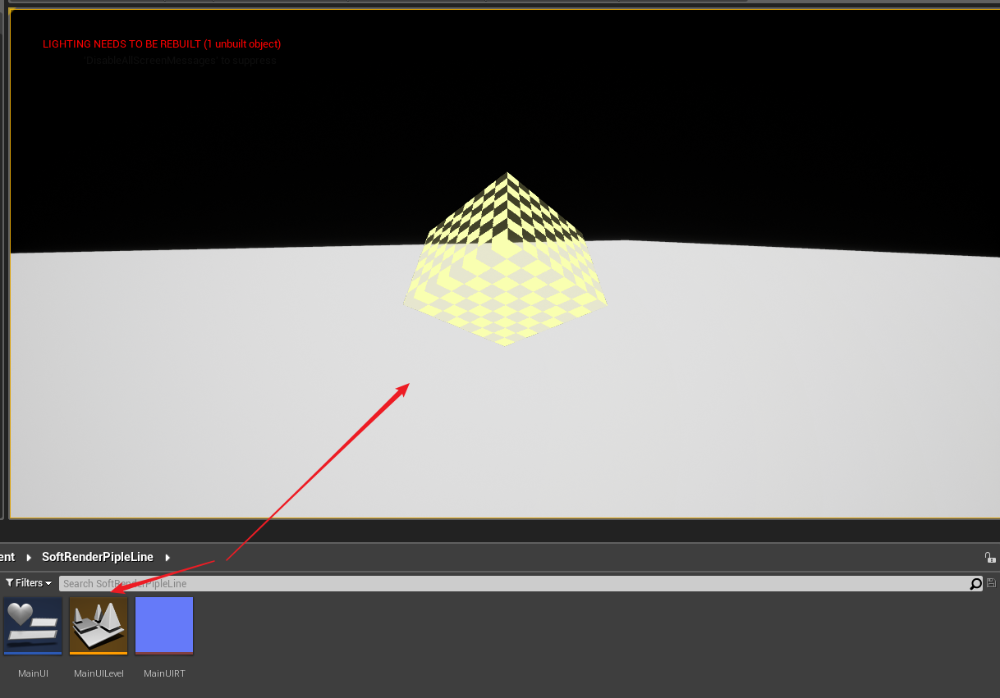
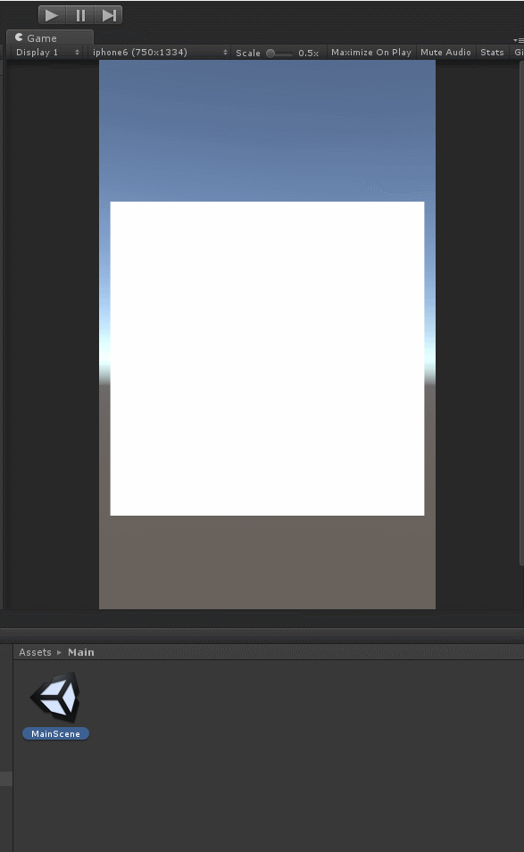

# 
## 一、Unreal工程
### 1、使用了Unreal的什么接口？
UMainUICpp里面有个MainImage 每帧会把软渲染器的数据显示到MainImage中，除此之外，没使用Unreal的其他接口。

### 2、使用
打开工程，打开MainUILevel关卡，然后运行就会如下显示

### 3、文档
具体看代码的注释：
https://github.com/wlxklyh/SoftRenderer/blob/master/Unreal/Source/Graphic/SoftRenderer/ScreenDevice.h

部分注释的截图

## 二、Unity工程

### 1、使用了Unity的什么接口？
MainScene下面有个Canvas Canvas有个Image,MainCode.cs脚本每帧会调用软渲染器的Draw,然后把FrameBuffer数据取出来 调用Unity的Texture2D.SetPixel接口 然后用Image把这个Texture2d显示出来。

### 2、使用
用Unity打开工程，然后打开MainScene 然后点击运行

### 3、文档
具体看代码的注释：https://github.com/wlxklyh/SoftRenderer/blob/master/Unity/Assets/MainCode.cs

## 三、android工程(TODO)

## 四、TODO
- 三角形裁剪完善
- 几何着色器和片元着色器完善
- BRDF光照模型
- 模板测试

## 附
**欢迎加微信讨论**
